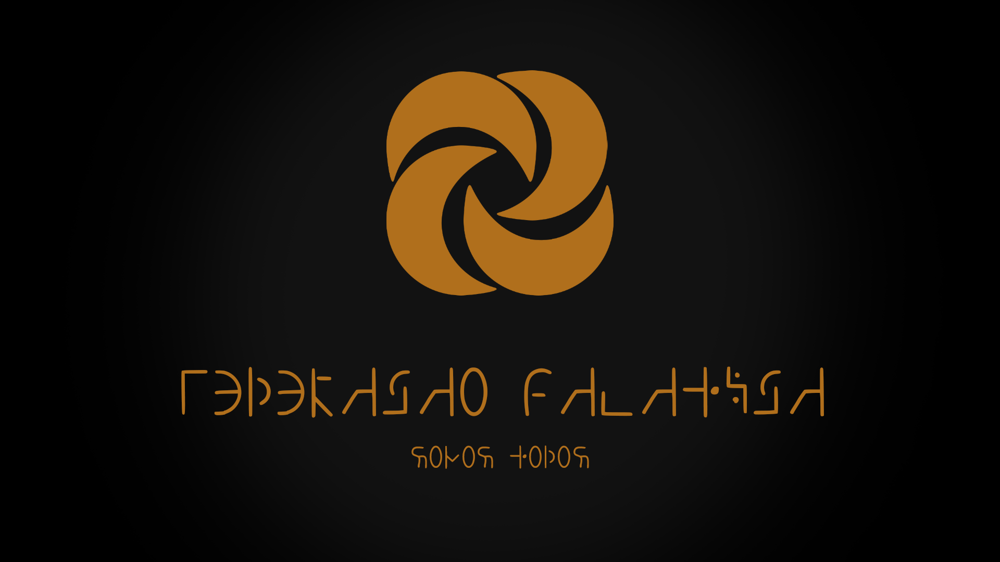

# M.C.C.T (Morpheus Character Creator Tool)



This is a character creator tool for a tabletop RPG called Morpheus. The user interface is currently in Portuguese, but the components and logic are written in English. You are free to use this code as a reference or as a foundation to build your own character creator.

To download the latest build, visit the [releases](https://github.com/fabriciohod/Morpheus-ui/releases) page. **Windows Only**


## Development

Before getting started, make sure you have [Node.js](https://nodejs.org/) and [Cargo](https://www.rust-lang.org/tools/install) (Rust package manager) installed on your system. Please refer to the respective websites for OS-specific installation guides.

1. After installing Rust and Cargo, follow these steps to install Tauri:
   - Open a terminal and navigate to the root directory of the project.
   - Run the following commands:
     ```shell
     cd ./src-tauri
     cargo build
     ```
   This will download and install Tauri and its dependencies.

2. To install Svelte and Skeleton UI, return to the root directory and run the following command:
   ```shell
   cd ..
   npm install
   ```
   This will install all project dependencies.

   You can now run the project using the following commands:
   ```shell
   # for development
   npm run tauri dev
   # or
   tauri dev

   # to make a build
   npm run tauri build
   # or
   tauri build

   # to create a debug build, add --debug at the end
   tauri build --debug
   ```

Please note that the user interface is currently in Portuguese, but you can modify the code to display the content in your desired language.